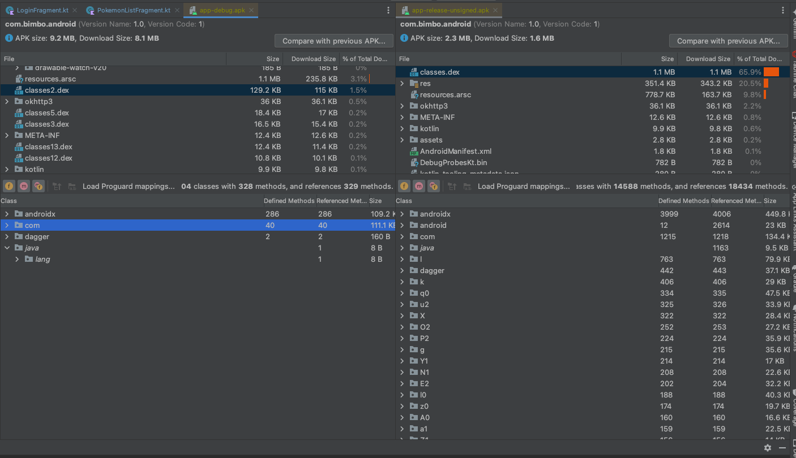

# bimbo-android
## Estructura del Proyecto con MVVM y Clean Architecture

Capas principales en Clean Architecture para Android
Capa	Contenido principal	Dependencias
Domain	Entidades, casos de uso (use cases), interfaces	Independiente de frameworks
Data	Repositorios, fuentes de datos (API, DB)	Implementa interfaces del dominio
Presentation	UI, ViewModels, adapters	Usa casos de uso del dominio

app/
└── src/
└── main/
├── java/com/tuapp/
│   ├── data/
│   │   ├── api/               # Retrofit, servicios web, DTOs de red
│   │   │    └── PokeApiService.kt
│   │   ├── db/                # Room, entidades, DAOs, TypeConverters
│   │   │    ├── PokemonDao.kt
│   │   │    ├── PokemonEntity.kt
│   │   │    └── Converters.kt
│   │   ├── repository/        # Implementación de repositorios
│   │   │    └── PokemonRepositoryImpl.kt
│   │   └── mapper/            # Mappers para convertir entre DTOs, entidades y modelos de dominio
│   │        └── PokemonMapper.kt
│   ├── domain/
│   │   ├── model/             # Entidades de negocio (modelos puros)
│   │   │    └── Pokemon.kt
│   │   ├── repository/        # Interfaces de repositorios (abstracciones)
│   │   │    └── PokemonRepository.kt
│   │   └── usecase/           # Casos de uso / interactores
│   │        └── GetPokemonsUseCase.kt
│   └── presentation/
│       ├── ui/                # Activities, Fragments, navegación
│       │    ├── pokemonlist/
│       │    │     └── PokemonListFragment.kt
│       │    └── pokemondetail/
│       │          └── PokemonDetailFragment.kt
│       ├── viewmodel/         # ViewModels
│       │    ├── PokemonListViewModel.kt
│       │    └── PokemonDetailViewModel.kt
│       └── adapter/           # Adaptadores RecyclerView
│            └── PokemonAdapter.kt
└── ...

# Uso de SharedPreferences para guardar datos en Android
¿Qué datos se guardan?
Durante el proceso de login, se suelen guardar datos esenciales para mantener la sesión activa y mejorar la experiencia del usuario, tales como:

Correo o nombre de usuario

Estado de sesión (por ejemplo, si el usuario está logueado)

¿Por qué usar SharedPreferences?
Es una forma sencilla y eficiente de guardar datos pequeños y persistentes.

Los datos se mantienen aunque la app se cierre o el dispositivo se reinicie.

El archivo es privado para la app, accesible solo desde ella (modo MODE_PRIVATE).

# Ofuscación del código en la aplicación

Para proteger la propiedad intelectual y dificultar la ingeniería inversa, nuestra aplicación utiliza la ofuscación de código en el build de release mediante herramientas como ProGuard y R8.

¿Qué es la ofuscación?
La ofuscación es un proceso que transforma el código compilado para hacerlo más difícil de entender y analizar. Esto se logra renombrando clases, métodos y variables con nombres irreconocibles, eliminando código y recursos no usados, y alterando el flujo lógico sin cambiar el comportamiento funcional.

Beneficios
Protección contra ingeniería inversa: dificulta que terceros puedan leer o copiar el código fuente.

Reducción del tamaño del APK: elimina código y recursos innecesarios, optimizando el espacio.

Mejora del rendimiento: al reducir el código y recursos, la app puede ejecutarse más eficientemente.

Resultado:

